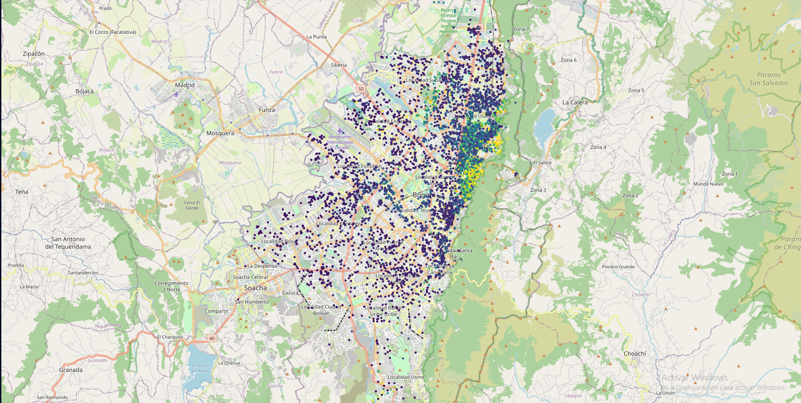

# 🏡 Predicción de precios de arriendo en Bogotá



Proyecto de ciencia de datos que busca predecir el precio de renta de un apartamento en la ciudad de Bogotá. Para ello, se extraen datos reales mediante técnicas de Web Scraping y se utilizan modelos de Machine Learning para predecir su valor.

## 🔍 Problema

Este análisis del precio de renta de apartamentos y cómo sus características influyen en este valor, es fundamental para optimizar el presupuesto de arriendo según las necesidades individuales. Para los arrendatarios (inquilinos), resulta crucial contar con una referencia clara de cuánto el mercado valora los inmuebles por sus comodidades y ubicación en la ciudad. Asimismo, para los arrendadores (propietarios), Esta estimación es clave para establecer un valor competitivo que evite tanto la subvaloración como el sobreprecio del inmueble frente al mercado.

## 📊 Dataset

- Fuente: [Finca Raíz (Web Scraping)](https://www.fincaraiz.com.co/)
- Nº de registros: 8.566 apartamentos
- Variables: longitude, latitude, stratum, bathrooms, constructed_area, house_age, bedrooms, parking, administration, floor, rent_price, facilities

## 🛠️ Técnicas usadas

- Web scraping con BeautifulSoup
- Análisis exploratorio de datos (EDA)
- Visualización de ubicación de propiedades en mapa con Folium
- Identificación de localidades con geopandas
- Selección de caracteristicas con Informacion Mutua (MI)
- Regression Lineal, Lasso, RandomForest, XGBoost
- Tunning de hiperparametros con GridSearchCV

## 📈 Resultados

- RMSE: 1614593.77 COP
- MAE: 839132.70 COP
- R²: 0.78
- Variables más importantes: longitude, latitude, constructed_area, house age

## 🧠 Lecciones aprendidas

Analizando las variables mas influyentes se encontro que las relacionadas o comodidades tanto interiores como exteriores no tiene influencia sobre el precio de arriendo de la propiedad. Y aspectos como la ubicación de la propiedad pueden elevar bastante el precio de la propiedad como es el caso de la localidad de Usaquen y Chapinero.

## 🚀 Cómo ejecutar este proyecto

Sigue los siguientes pasos para ejecutar el proyecto en tu máquina local:

### 1️⃣ Clona el repositorio
```bash
git clone https://github.com/Miguel9Angel/home_price_bogota.git
cd home_price_bogota
```

### 2️⃣ Requisitos
pip install -r requirements.txt

### 3️⃣ Ejecuta el notebook
jupyter notebook notebooks/eda_modelo_final.ipynb

## 📁 Estructura del repositorio
HOME_PRICE_BOGOTA/
├── assets/ # Imágenes y visualizaciones para el README
│ └── aparments_by_price_bogota.png
│
├── data/ # Datos en crudo y procesados
│ ├── Real_State_Bogota.csv
│ └── localidades_Bogota.json
│
├── notebooks/ # Notebooks del análisis y scraping
│ ├── apto_analisis_bogota.ipynb
│ └── house_price_scraping_bogota.ipynb
│
├── requirements.txt # Dependencias del proyecto
├── README.md # Documentación principal del repositorio

## 📜 Licencia

Este proyecto está licenciado bajo la [Licencia MIT](./LICENSE).  
Puedes usar, modificar y distribuir este código libremente dando el crédito correspondiente.

--------------------------------------------------------------------------------------

## 🙋 Sobre mí

Me llamo Miguel Angel Soler Otalora, soy ingeniero mecánico con formación en ciencia de datos e inteligencia artificial. Combino el pensamiento analítico y estructurado de la ingeniería con habilidades modernas de análisis de datos, visualización y modelado predictivo.

Este proyecto forma parte de mi portafolio para aplicar a roles como Data Analyst o Data Scientist, y refleja mi interés por aplicar el análisis de datos al mundo real.

📫 Puedes contactarme por [LinkedIn](https://linkedin.com/in/miguel-soler-ml) o ver más proyectos en [GitHub](https://github.com/Miguel9Angel).
